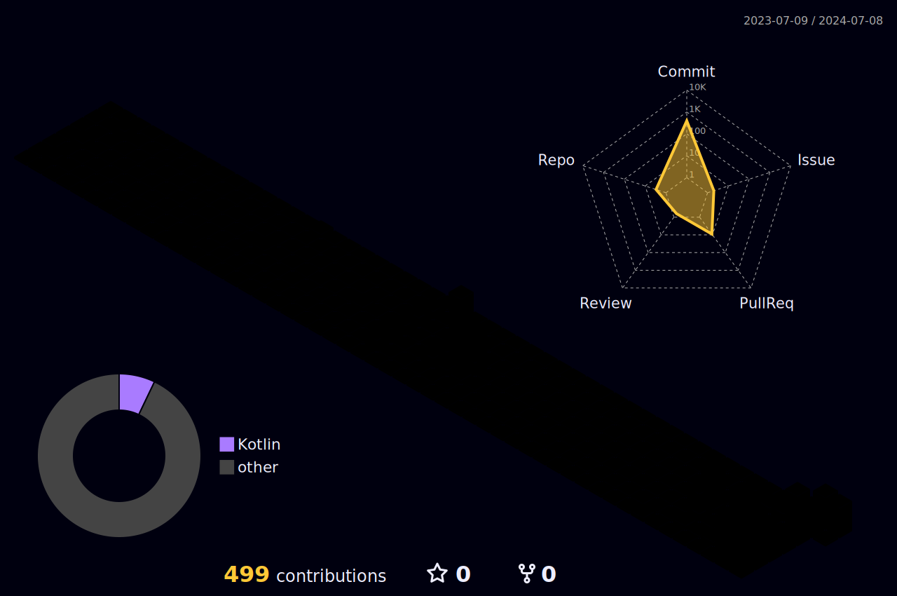

<h1 align="center">
  
  Welcome to Batapii's Android Coding Universe!
  
</h1>

<p align="center">
  
</p>

<div align="center">

[](https://github.com/iwbc-mzk/atcoder-readme-stats)


  
[](https://github.com/batapii)
[](https://twitter.com/batapii3939)

</div>

## 🚀 About Me
I'm an Android developer based in Japan, passionate about creating innovative mobile applications and always eager to learn new technologies. With a keen eye for design and a love for clean code, I strive to build apps that not only function flawlessly but also provide an exceptional user experience.

<details>
<summary>🌟 More About Me</summary>

- 🔭 I'm currently working on revolutionizing mobile productivity apps
- 🌱 I'm currently learning Kotlin Multiplatform and Jetpack Compose
- 👯 I'm looking to collaborate on open-source Android projects

</details>

<h2 align="center">🏆 GitHub Trophies</h2>
<p align="center">
  
</p>

## 🌈 Skill Spectrum

<div align="center">


</div>


# 📊 My Coding Insights

## 📅 This Week
<!--START_SECTION:waka-week-->


**🐱 My GitHub Data** 

> 📦 3.0 kB Used in GitHub's Storage 
 > 
> 🏆 780 Contributions in the Year 2024
 > 
> 🚫 Not Opted to Hire
 > 
> 📜 3 Public Repositories 
 > 
> 🔑 4 Private Repositories 
 > 
**I'm an Early 🐤** 

```text
🌞 Morning                634 commits         █████████░░░░░░░░░░░░░░░░   36.21 % 
🌆 Daytime                781 commits         ███████████░░░░░░░░░░░░░░   44.60 % 
🌃 Evening                120 commits         ██░░░░░░░░░░░░░░░░░░░░░░░   06.85 % 
🌙 Night                  216 commits         ███░░░░░░░░░░░░░░░░░░░░░░   12.34 % 
```
📅 **I'm Most Productive on Monday** 

```text
Monday                   650 commits         █████████░░░░░░░░░░░░░░░░   37.12 % 
Tuesday                  133 commits         ██░░░░░░░░░░░░░░░░░░░░░░░   07.60 % 
Wednesday                372 commits         █████░░░░░░░░░░░░░░░░░░░░   21.25 % 
Thursday                 279 commits         ████░░░░░░░░░░░░░░░░░░░░░   15.93 % 
Friday                   147 commits         ██░░░░░░░░░░░░░░░░░░░░░░░   08.40 % 
Saturday                 100 commits         █░░░░░░░░░░░░░░░░░░░░░░░░   05.71 % 
Sunday                   70 commits          █░░░░░░░░░░░░░░░░░░░░░░░░   04.00 % 
```


📊 **This Week I Spent My Time On** 

```text
💬 Programming Languages: 
Kotlin                   7 hrs 4 mins        █████████████████████████   99.97 % 
GitIgnore file           0 secs              ░░░░░░░░░░░░░░░░░░░░░░░░░   00.01 % 
Shell Script             0 secs              ░░░░░░░░░░░░░░░░░░░░░░░░░   00.01 % 
Properties               0 secs              ░░░░░░░░░░░░░░░░░░░░░░░░░   00.01 % 
textmate                 0 secs              ░░░░░░░░░░░░░░░░░░░░░░░░░   00.00 % 

🔥 Editors: 
Android Studio           7 hrs 4 mins        █████████████████████████   100.00 % 

🐱‍💻 Projects: 
ToDoSNS                  7 hrs 4 mins        █████████████████████████   100.00 % 

💻 Operating System: 
Mac                      7 hrs 4 mins        █████████████████████████   100.00 % 
```


 Last Updated on 22/10/2024 12:47:13 UTC
<!--END_SECTION:waka-week-->

## 📅 This Month
<!--START_SECTION:wakamonth-->

```txt
From: 21 September 2024 - To: 21 October 2024

Total Time: 32 hrs 53 mins

Kotlin           30 hrs 32 mins  █████████████████████▓░░░   86.66 %
Other            2 hrs 20 mins   █▓░░░░░░░░░░░░░░░░░░░░░░░   06.66 %
Swift            1 hr 14 mins    █░░░░░░░░░░░░░░░░░░░░░░░░   03.53 %
Image (svg)      35 mins         ▒░░░░░░░░░░░░░░░░░░░░░░░░   01.67 %
Text             17 mins         ▒░░░░░░░░░░░░░░░░░░░░░░░░   00.83 %
JSON             11 mins         ░░░░░░░░░░░░░░░░░░░░░░░░░   00.54 %
XML              1 min           ░░░░░░░░░░░░░░░░░░░░░░░░░   00.06 %
Cocoa            0 secs          ░░░░░░░░░░░░░░░░░░░░░░░░░   00.04 %
Properties       0 secs          ░░░░░░░░░░░░░░░░░░░░░░░░░   00.01 %
Git              0 secs          ░░░░░░░░░░░░░░░░░░░░░░░░░   00.00 %
```

<!--END_SECTION:wakamonth-->

## 📊 Lifetime Coding Stats

<!--START_SECTION:wakaalltime-->

```txt
From: 23 January 2024 - To: 21 October 2024

Total Time: 251 hrs 59 mins

Kotlin                 124 hrs 45 mins ████████████▒░░░░░░░░░░░░   49.51 %
Other                  105 hrs 30 mins ██████████▒░░░░░░░░░░░░░░   41.87 %
Swift                  5 hrs 39 mins   ▓░░░░░░░░░░░░░░░░░░░░░░░░   02.25 %
Text                   3 hrs 2 mins    ▒░░░░░░░░░░░░░░░░░░░░░░░░   01.21 %
XML                    2 hrs 12 mins   ▒░░░░░░░░░░░░░░░░░░░░░░░░   00.87 %
TOML                   2 hrs 4 mins    ▒░░░░░░░░░░░░░░░░░░░░░░░░   00.82 %
Figma Design           1 hr 57 mins    ▒░░░░░░░░░░░░░░░░░░░░░░░░   00.78 %
Cocoa                  1 hr 6 mins     ░░░░░░░░░░░░░░░░░░░░░░░░░   00.44 %
JSON                   1 hr 1 min      ░░░░░░░░░░░░░░░░░░░░░░░░░   00.41 %
GitIgnore file         45 mins         ░░░░░░░░░░░░░░░░░░░░░░░░░   00.30 %
```

<!--END_SECTION:wakaalltime-->

Last Updated on 10/07/2024 04:52:24 UTC

## 🌟 Featured Projects

<div align="center">
  <a href="https://github.com/batapii/ToDoSNS">
    
  </a>

## 📈 GitHub Stats

<div align="center">
  
  
  
[](https://github.com/ashutosh00710/github-readme-activity-graph)
</div>

## 🎵 Now Listening on Apple Music

<div align="center">
  
[](https://github.com/rayriffy/apple-music-github-profile)

</div>


## 🏆 Coding Achievements

<div align="center">

[](https://holopin.io/@batapii)

</div>

## 💡 A Random Dev Quote

<div align="center">


</div>

</div>

## 🚀 3D Contribution Calendar

<div align="center">
  


</div>
