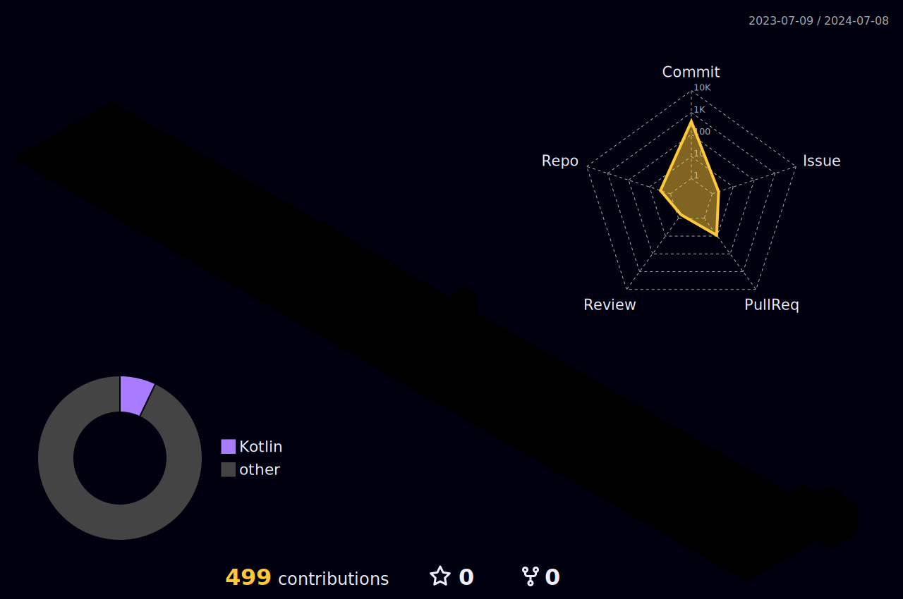

<div align="center">
  


<div style="margin-top: -20px;">
  
</div>

<a href="https://git.io/typing-svg">
  
</a>

## 🏆 Achievements

[](https://github.com/ryo-ma/github-profile-trophy)

## 🎯 Github Profile Summary

<div align="center">
  
  
  
  
  
</div>

## 💻 Technology & Social

<div align="center" style="background: linear-gradient(to right, #282A36, #44475A); padding: 20px; border-radius: 10px;">

[](https://github.com/anuraghazra/github-readme-stats)

<div style="margin-top: 15px">
<a href="https://github.com/batapii"></a>
<a href="https://twitter.com/batapii3939"></a>
</div>

</div>

<div align="center">

</div>


## 📊 Performance Metrics

<div align="center">


[](https://github.com/iwbc-mzk/atcoder-readme-stats)

</div>

## ⌨️ Coding Activity

### 🌟 Commit Activity
<!--START_SECTION:commit-stats-->


**🐱 My GitHub Data** 

> 📦 7.4 kB Used in GitHub's Storage 
 > 
> 🏆 168 Contributions in the Year 2026
 > 
> 🚫 Not Opted to Hire
 > 
> 📜 5 Public Repositories 
 > 
> 🔑 8 Private Repositories 
 > 
**I'm an Early 🐤** 

```text
🌞 Morning                2294 commits        █████████░░░░░░░░░░░░░░░░   35.45 % 
🌆 Daytime                2993 commits        ████████████░░░░░░░░░░░░░   46.25 % 
🌃 Evening                882 commits         ███░░░░░░░░░░░░░░░░░░░░░░   13.63 % 
🌙 Night                  302 commits         █░░░░░░░░░░░░░░░░░░░░░░░░   04.67 % 
```
📅 **I'm Most Productive on Monday** 

```text
Monday                   1744 commits        ███████░░░░░░░░░░░░░░░░░░   26.95 % 
Tuesday                  1102 commits        ████░░░░░░░░░░░░░░░░░░░░░   17.03 % 
Wednesday                970 commits         ████░░░░░░░░░░░░░░░░░░░░░   14.99 % 
Thursday                 1546 commits        ██████░░░░░░░░░░░░░░░░░░░   23.89 % 
Friday                   553 commits         ██░░░░░░░░░░░░░░░░░░░░░░░   08.55 % 
Saturday                 279 commits         █░░░░░░░░░░░░░░░░░░░░░░░░   04.31 % 
Sunday                   277 commits         █░░░░░░░░░░░░░░░░░░░░░░░░   04.28 % 
```


**I Mostly Code in Kotlin** 

```text
Kotlin                   6 repos             ███████████░░░░░░░░░░░░░░   42.86 % 
HTML                     3 repos             █████░░░░░░░░░░░░░░░░░░░░   21.43 % 
JavaScript               2 repos             ████░░░░░░░░░░░░░░░░░░░░░   14.29 % 
CSS                      1 repo              ██░░░░░░░░░░░░░░░░░░░░░░░   07.14 % 
TypeScript               1 repo              ██░░░░░░░░░░░░░░░░░░░░░░░   07.14 % 
```


 Last Updated on 30/06/2026 02:01:31 UTC
<!--END_SECTION:commit-stats-->

### 💻 Weekly Development
<!--START_SECTION:wakatime-->

```txt
Total Time: 0 secs

Other   3 hrs 26 mins         █████████████████████████   100.00 %
```

<!--END_SECTION:wakatime-->

### 🔨 Development Environment
<!--START_SECTION:dev-stats-->


📊 **This Week I Spent My Time On** 

```text
🕑︎ Time Zone: Asia/Tokyo

🔥 Editors: 
Zoom                     3 hrs 18 mins       ████████████████████████░   96.20 % 
Warp                     7 mins              █░░░░░░░░░░░░░░░░░░░░░░░░   03.80 % 

🐱‍💻 Projects: 
01_1                     3 hrs 26 mins       █████████████████████████   100.00 % 

💻 Operating System: 
Mac                      3 hrs 26 mins       █████████████████████████   100.00 % 
```


 Last Updated on 30/06/2026 02:01:39 UTC
<!--END_SECTION:dev-stats-->

### 📈 Monthly Stats
<!--START_SECTION:wakamonth-->

```txt
Total Time: 4 hrs 37 mins

Other         16 hrs 29 mins        ███████████████████▓░░░░░   78.09 %
CSS           1 hr 42 mins          ██░░░░░░░░░░░░░░░░░░░░░░░   08.05 %
JavaScript    1 hr 31 mins          █▓░░░░░░░░░░░░░░░░░░░░░░░   07.25 %
Swift         41 mins               ▓░░░░░░░░░░░░░░░░░░░░░░░░   03.24 %
Cocoa         33 mins               ▓░░░░░░░░░░░░░░░░░░░░░░░░   02.65 %
HTML          7 mins                ░░░░░░░░░░░░░░░░░░░░░░░░░   00.56 %
Text          0 secs                ░░░░░░░░░░░░░░░░░░░░░░░░░   00.07 %
Image (png)   0 secs                ░░░░░░░░░░░░░░░░░░░░░░░░░   00.07 %
Git Config    0 secs                ░░░░░░░░░░░░░░░░░░░░░░░░░   00.03 %
```

<!--END_SECTION:wakamonth-->

### 🏆 All Time Stats
<!--START_SECTION:wakaalltime-->

```txt
Total Time: 360 hrs 9 mins

Other                  463 hrs 16 mins       ██████████████░░░░░░░░░░░   56.26 %
Kotlin                 214 hrs 23 mins       ██████▓░░░░░░░░░░░░░░░░░░   26.04 %
Swift                  46 hrs 15 mins        █▒░░░░░░░░░░░░░░░░░░░░░░░   05.62 %
TypeScript             20 hrs 37 mins        ▓░░░░░░░░░░░░░░░░░░░░░░░░   02.51 %
Cocoa                  10 hrs 8 mins         ▒░░░░░░░░░░░░░░░░░░░░░░░░   01.23 %
YAML                   9 hrs 25 mins         ▒░░░░░░░░░░░░░░░░░░░░░░░░   01.15 %
C#                     8 hrs 5 mins          ▒░░░░░░░░░░░░░░░░░░░░░░░░   00.98 %
Image (svg)            7 hrs 7 mins          ▒░░░░░░░░░░░░░░░░░░░░░░░░   00.86 %
CSS                    5 hrs 39 mins         ▒░░░░░░░░░░░░░░░░░░░░░░░░   00.69 %
HTTP Request           5 hrs 14 mins         ░░░░░░░░░░░░░░░░░░░░░░░░░   00.64 %
JavaScript             5 hrs 6 mins          ░░░░░░░░░░░░░░░░░░░░░░░░░   00.62 %
JSON                   4 hrs 59 mins         ░░░░░░░░░░░░░░░░░░░░░░░░░   00.61 %
Text                   4 hrs 3 mins          ░░░░░░░░░░░░░░░░░░░░░░░░░   00.49 %
HTML                   3 hrs 3 mins          ░░░░░░░░░░░░░░░░░░░░░░░░░   00.37 %
Figma Design           3 hrs 2 mins          ░░░░░░░░░░░░░░░░░░░░░░░░░   00.37 %
```

<!--END_SECTION:wakaalltime-->


## 🌟 Featured Creation & Contributions

<div align="center">
  <a href="https://github.com/batapii/ToDoSNS">
    
  </a>

[](https://github.com/ashutosh00710/github-readme-activity-graph)



[](https://holopin.io/@batapii)

</div>

## 🎵 Now Playing

<div align="center">
  
[](https://github.com/rayriffy/apple-music-github-profile)

</div>


</div>
