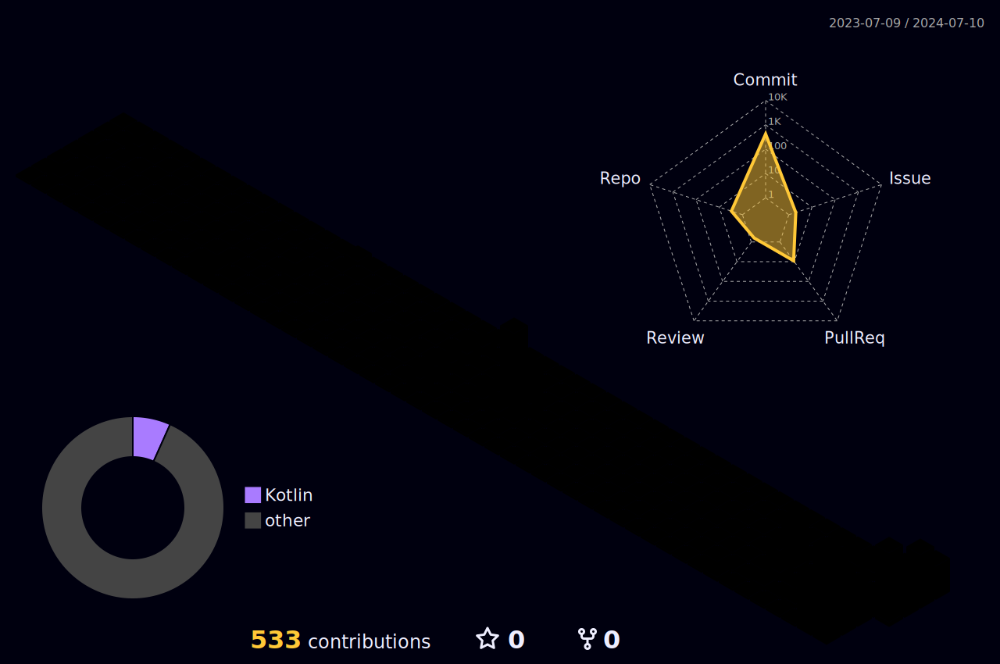

<h1 align="center">
  
  Welcome to Batapii's Android Coding Universe!
  
</h1>

<p align="center">
  
</p>

<div align="center">


  
[](https://github.com/batapii)
[](https://twitter.com/batapii3939)

</div>

## 🚀 About Me
I'm an Android developer based in Japan, passionate about creating innovative mobile applications and always eager to learn new technologies. With a keen eye for design and a love for clean code, I strive to build apps that not only function flawlessly but also provide an exceptional user experience.

<details>
<summary>🌟 More About Me</summary>

- 🔭 I'm currently working on revolutionizing mobile productivity apps
- 🌱 I'm currently learning Kotlin Multiplatform and Jetpack Compose
- 👯 I'm looking to collaborate on open-source Android projects
- 💬 Ask me about Android development, Kotlin, and mobile UX design
- ⚡ Fun fact: I can solve a Rubik's cube in under 2 minutes!

</details>

<h2 align="center">🏆 GitHub Trophies</h2>
<p align="center">
  
</p>

## 🌈 Skill Spectrum

<div align="center">


</div>


## 📊 My Coding Insights


<!--START_SECTION:waka-->


**I'm an Early 🐤** 

```text
🌞 Morning                202 commits         ███████░░░░░░░░░░░░░░░░░░   26.61 % 
🌆 Daytime                324 commits         ███████████░░░░░░░░░░░░░░   42.69 % 
🌃 Evening                121 commits         ████░░░░░░░░░░░░░░░░░░░░░   15.94 % 
🌙 Night                  112 commits         ████░░░░░░░░░░░░░░░░░░░░░   14.76 % 
```
📅 **I'm Most Productive on Wednesday** 

```text
Monday                   155 commits         █████░░░░░░░░░░░░░░░░░░░░   20.42 % 
Tuesday                  64 commits          ██░░░░░░░░░░░░░░░░░░░░░░░   08.43 % 
Wednesday                217 commits         ███████░░░░░░░░░░░░░░░░░░   28.59 % 
Thursday                 115 commits         ████░░░░░░░░░░░░░░░░░░░░░   15.15 % 
Friday                   98 commits          ███░░░░░░░░░░░░░░░░░░░░░░   12.91 % 
Saturday                 70 commits          ██░░░░░░░░░░░░░░░░░░░░░░░   09.22 % 
Sunday                   40 commits          █░░░░░░░░░░░░░░░░░░░░░░░░   05.27 % 
```


📊 **This Week I Spent My Time On** 

```text
💬 Programming Languages: 
Kotlin                   13 hrs 19 mins      ███████████████████░░░░░░   74.82 % 
Other                    2 hrs 52 mins       ████░░░░░░░░░░░░░░░░░░░░░   16.11 % 
Figma Design             1 hr 14 mins        ██░░░░░░░░░░░░░░░░░░░░░░░   07.02 % 
Text                     17 mins             ░░░░░░░░░░░░░░░░░░░░░░░░░   01.66 % 
TOML                     3 mins              ░░░░░░░░░░░░░░░░░░░░░░░░░   00.33 % 

🔥 Editors: 
Android Studio           11 hrs 58 mins      █████████████████░░░░░░░░   67.27 % 
Xcode                    2 hrs 7 mins        ███░░░░░░░░░░░░░░░░░░░░░░   11.95 % 
Slack                    2 hrs 7 mins        ███░░░░░░░░░░░░░░░░░░░░░░   11.93 % 
Figma                    1 hr 14 mins        ██░░░░░░░░░░░░░░░░░░░░░░░   07.02 % 
Chrome                   19 mins             ░░░░░░░░░░░░░░░░░░░░░░░░░   01.83 % 

🐱‍💻 Projects: 
ToDoSNS                  14 hrs 5 mins       ████████████████████░░░░░   79.15 % 
Unknown Project          3 hrs 41 mins       █████░░░░░░░░░░░░░░░░░░░░   20.76 % 
ToDoKMP                  0 secs              ░░░░░░░░░░░░░░░░░░░░░░░░░   00.09 % 

💻 Operating System: 
Mac                      17 hrs 48 mins      █████████████████████████   100.00 % 
```


 Last Updated on 08/07/2024 00:34:16 UTC
<!--END_SECTION:waka-->


## 🌟 Featured Projects

<div align="center">
  <a href="https://github.com/batapii/ToDoSNS">
    
  </a>

## 📈 GitHub Stats

<div align="center">
  
  
  
[](https://github.com/ashutosh00710/github-readme-activity-graph)
</div>

## 🎵 Now Listening on Apple Music

<div align="center">
  
[](https://github.com/rayriffy/apple-music-github-profile)

</div>


## 🏆 Coding Achievements

<div align="center">

[](https://holopin.io/@batapii)

</div>

## 💡 A Random Dev Quote

<div align="center">


</div>

</div>

## 🚀 3D Contribution Calendar

<div align="center">
  


</div>
