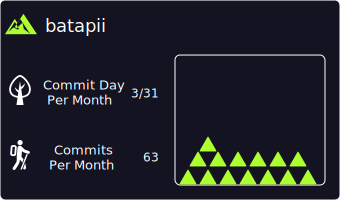

<h1 align="center">
  
  Welcome to Batapii's Android Coding Universe!
  
</h1>

  

## 🚀 About Me
[Brief introduction about yourself, your interests, and what you're currently working on]

## 📊 My Coding Insights

<b>🱠GitHub Data</b>

<!--START_SECTION:github-data-->
[Your GitHub data will be inserted here]
<!--END_SECTION:github-data-->

<b>⏱ Coding Habits</b>

<!--START_SECTION:coding-habits-->
[Your coding habits data will be inserted here]
<!--END_SECTION:coding-habits-->

<b>📅 Weekly Breakdown</b>

<!--START_SECTION:weekly-breakdown-->
[Your weekly breakdown data will be inserted here]
<!--END_SECTION:weekly-breakdown-->

## 🏆 GitHub Trophies

## 🔧 Technologies & Tools

## 📈 GitHub Stats

## 📊 Contribution Graph

## 💼 Featured Projects

## 📝 Latest Blog Posts
<!-- BLOG-POST-LIST:START -->
- [Your blog post title](Your blog post URL)
<!-- BLOG-POST-LIST:END -->

⭐️ From [yourusername](https://github.com/yourusername)

<!--START_SECTION:activity-->
<!--END_SECTION:activity-->
